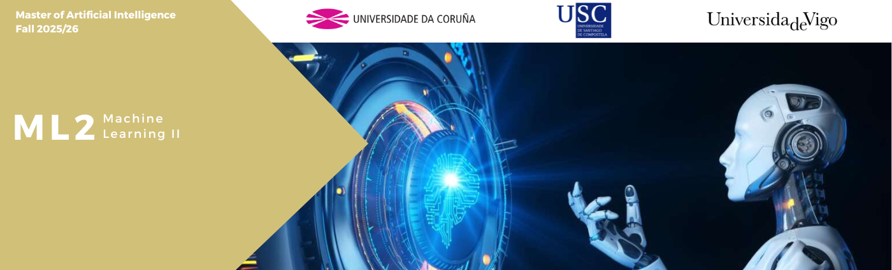

This repository contains a set of tutorials which are the introduction for the topics covered in the subject Machine Learning II of the Master in Artificial Intelligence taught at the three universities of Galicia: University of A Coruña (UDC), University of Santiago de Compostela (USC), and University of Vigo (UVigo).

- [Teaching Staff](#teaching-staff)
- [Development Environment](#development-environment)
  - [Quick guide: package and environment management with uv](#quick-guide-package-and-environment-management-with-uv)
  - [Install Required Packages](#install-required-packages)
- [Notebooks](#notebooks)
- [Jupyter](#jupyter)
- [Troubleshooting](#troubleshooting)
- [Notes](#notes)


# Teaching Staff:
* David Mera Pérez (coordinator, USC)
* Enrique Fernández Blanco (UDC)
* David Olivieri Cecchi (UVigo)


# Development Environment

The practical sessions will be developed via Notebooks. To run them you will need Python (>3.8), a Notebook server (e.g., Jupyter), and all the necessary packages. There are different configuration options depending on your preferences:

1. **Google Colab**: Run the Notebooks online and install extra libraries using commands such as `!pip install xxx`. The free tier has some limitations, mainly related to computing resources.

2. **Python + pip + virtual environments**: Install Python (>3.8) from the official website. Dependencies can be installed using `pip` inside a virtual environment.

3. **uv**: A fast Python package and environment manager that replaces conda for this course. It creates standard virtual environments and uses `pip`-compatible workflows.

---

## Quick guide: package and environment management with `uv`

This project uses **`uv`** as an alternative to conda for managing Python environments and dependencies.  
`uv` creates **standard Python virtual environments**, so the usual `pip` workflows apply.

### Create the virtual environment

From the root of the repository:

```bash
uv venv
```

This creates a standard virtual environment in `.venv/`.

---

### Activate the environment

`uv` does **not** provide its own `activate` command.  
Activation is done using the standard Python `venv` scripts.

**macOS / Linux**
```bash
source .venv/bin/activate
```

**Windows (PowerShell)**
```powershell
.\.venv\Scripts\Activate.ps1
```

---

### Install all project dependencies

With the corresponding environment activated, all dependencies are defined in `requirements.txt` and can be installed.

```bash
pip install -r requirements.txt
```

> Since the environment was created with `uv`, this `pip` command installs packages inside the project virtual environment.

---

### Install a single package

If the environment is activated:

```bash
pip install package_name
```

Example:
```bash
pip install river
```

---

### Install packages **without activating** the environment (alternative)

You can also use `uv` directly:

```bash
uv pip install package_name
```

Examples:
```bash
uv pip install river
uv pip install "flwr[simulation]"
uv pip install -r requirements.txt
```

This automatically installs packages into the project virtual environment (`.venv`).

---

### Run commands inside the environment (without activation)

Instead of activating the environment, you may use:

```bash
uv run command
```

Example:
```bash
uv run jupyter notebook
```

This ensures the command runs using the project virtual environment.

---

### Summary

| Task | Recommended command |
|---|---|
| Create environment | `uv venv` |
| Activate environment | `source .venv/bin/activate` |
| Install dependencies | `pip install -r requirements.txt` |
| Install one package | `pip install package_name` |
| Install without activation | `uv pip install package_name` |
| Run command without activation | `uv run command` |


## Install Required Packages


The table below summarizes the main libraries used in the course. **You do not need to install them one-by-one** (they are already included in `requirements.txt`), but this overview can help you understand what each unit relies on.

| Package | Used for | Notes |
|---|---|---|
| `jupyter` / `ipykernel` | Running notebooks locally | Optional kernel registration supported |
| `numpy`, `pandas` | Data manipulation | Core scientific stack |
| `matplotlib` | Plotting | Figures in notebooks |
| `scikit-learn==1.7.2` | Classical ML + utilities | **Pinned** for River compatibility |
| `river` | Online learning + concept drift | Early units (Online ML) |
| `flwr[simulation]` | Federated learning simulations | Simulation extras required |
| `tensorflow` | Federated learning labs | Model training backend |
| `ray[default]` | Flower simulation backend | Required by Flower simulation mode |
| `python-graphviz` | Visualization | Some notebooks use Graphviz |
| `rich` | Pretty console output | Used in some examples |

---

## Notebooks

To obtain the notebooks for laboratory practices, you can either download the ZIP file from GitHub or clone the repository using Git:

```bash
git clone git@github.com:ennanco/MIA_ML2.git
```

**Important:** The examples located within the initial three working units (online ML + Concept Drift) have been specifically tailored for compatibility with **River 0.22**.

---

## Jupyter

With the virtual environment activated, run:

```bash
jupyter notebook
```

Then open your browser at `http://localhost:8888/`.

The security token will be shown in the terminal.

### Optional: Install a dedicated kernel

```bash
python -m ipykernel install --user --name mia-ml2 --display-name "Python (MIA-ML2)"
```

This allows selecting the correct environment from within Jupyter.

---

# Troubleshooting

- River’s wrapper module, designed for integration with libraries like scikit-learn, currently has compatibility issues.
  Scikit-Learn versions ≥ 1.8.0 exhibit integration problems with River, resulting in the following error in Unit02:

```
'super' object has no attribute '__sklearn_tags__'
```

Until River is updated, the recommended workaround is to downgrade scikit-learn:

```bash
pip uninstall scikit-learn
pip install "scikit-learn==1.7.2"
```

---

## Notes

- Always ensure you are using the `pip` from the active virtual environment.
- You may also use Google Colab if you prefer not to install anything locally.
